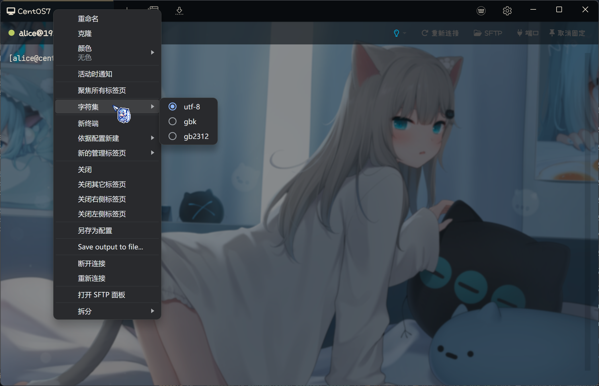
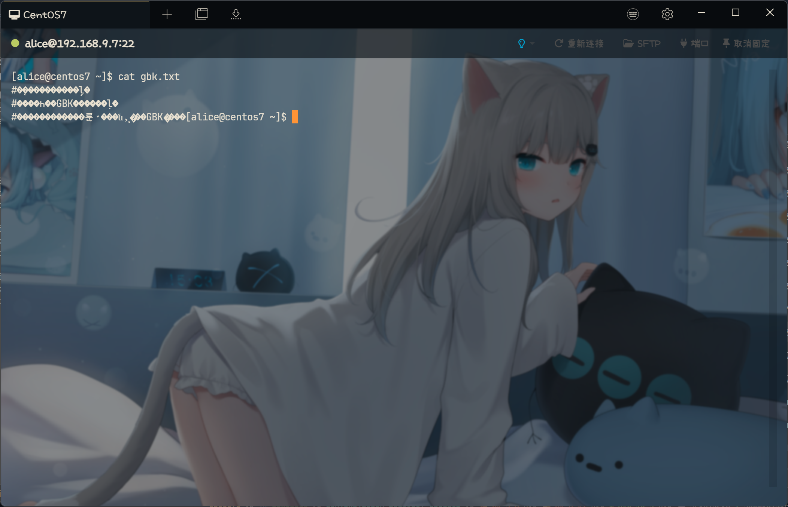
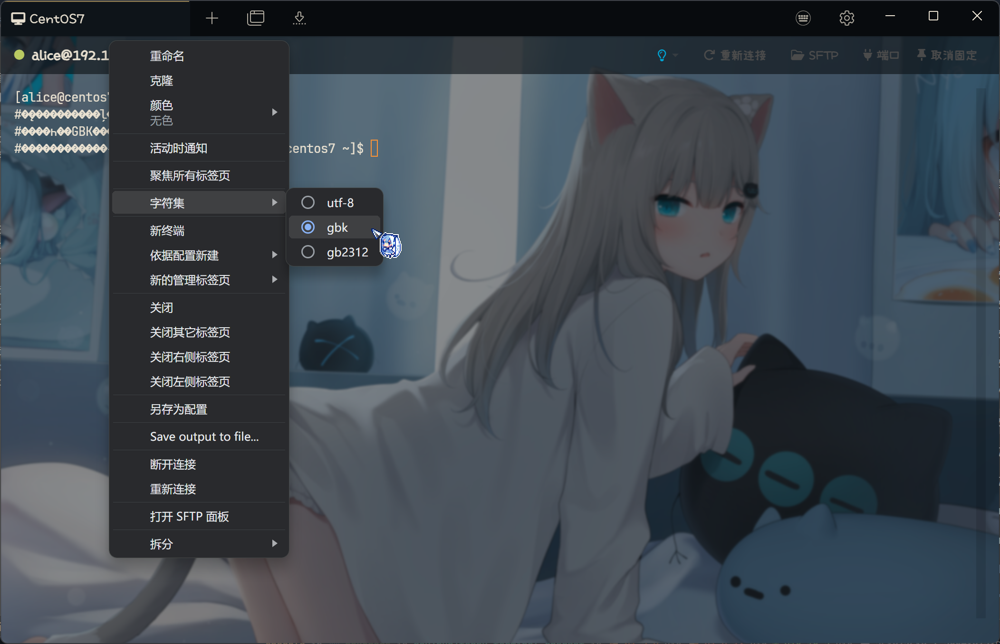
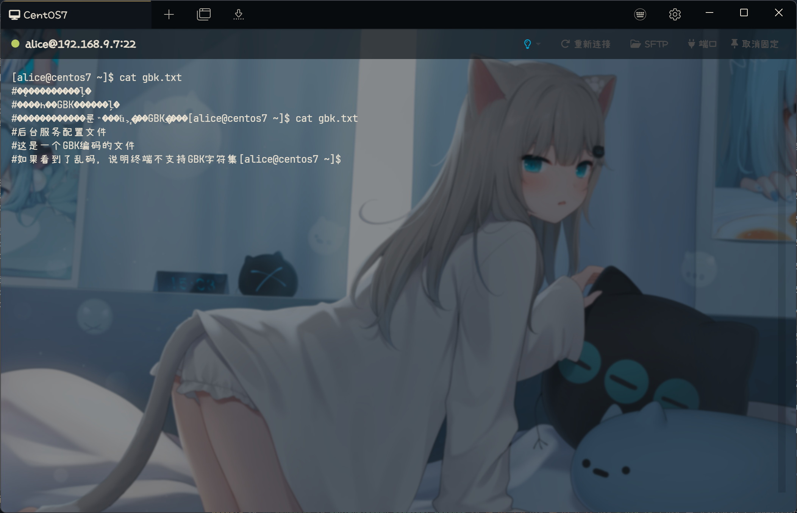

# Tabby Terminal Charset Plugin

Change Tabby terminal output charset from utf-8 to gbk, gb2312 etc...

## Features

- [x] Support GBK charset.
- [x] Support GB2312 charset.
- [x] Support GB18030 charset. **Not Tested**
- [x] Support Shift_JIS charset. **Not Tested**
- [x] Support Big5 charset. **Not Tested**
- [x] Support ISO charset (ISO-8859-1 - ISO-8859-16). **Not Tested**
- [x] Support Windows codepages (cp874, cp1250 - cp1258). **Not Tested**
- [x] Support IBM codepages (437, 720, 737, 775, 808, 850, 852, 855-858, 860-866, 869, 922, 1046, 1124, 1125, 1129, 1133, 1161-1163). **Not Tested**
- [x] Support output.
- [x] Support input.
- [x] Tested on Windows with Tabby version 1.0.207.

## Usage

### Install

To install, use Tabby builtin plugin manager.

### Change Charset

To change terminal charset, use the context menu from tab header.

### Known Issue

When use charset other then UTF-8, but the file you view is using UTF-8, the terminal is also display as well.
That is mean the terminal will both support UTF-8 and selected charset.
Tabby not recognize charset other then UTF-8, using backspace to delete input will cause gabled character
This plugin is only for emergency use, the output may become mess if there are multiply charset mixed in one page.

## Screenshot

### UTF-8

### GBK

## Changelog

- 1.0.2: Support input & output.
- 1.0.0: Initial version.
