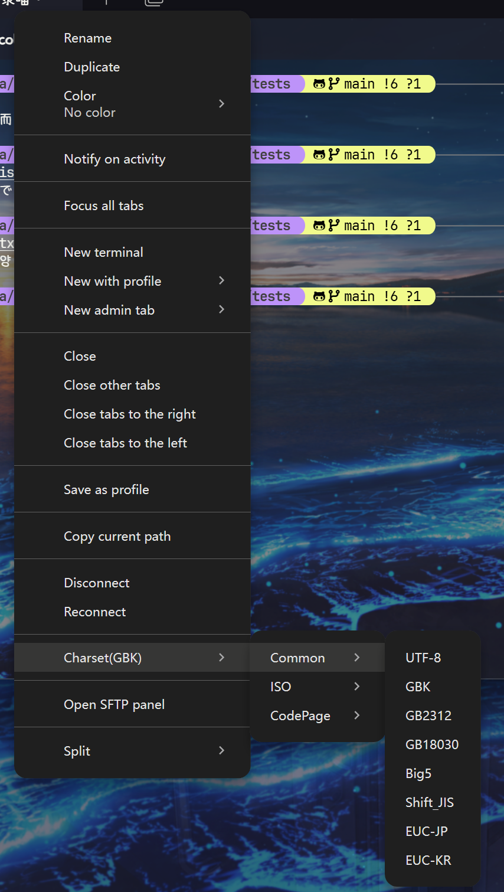
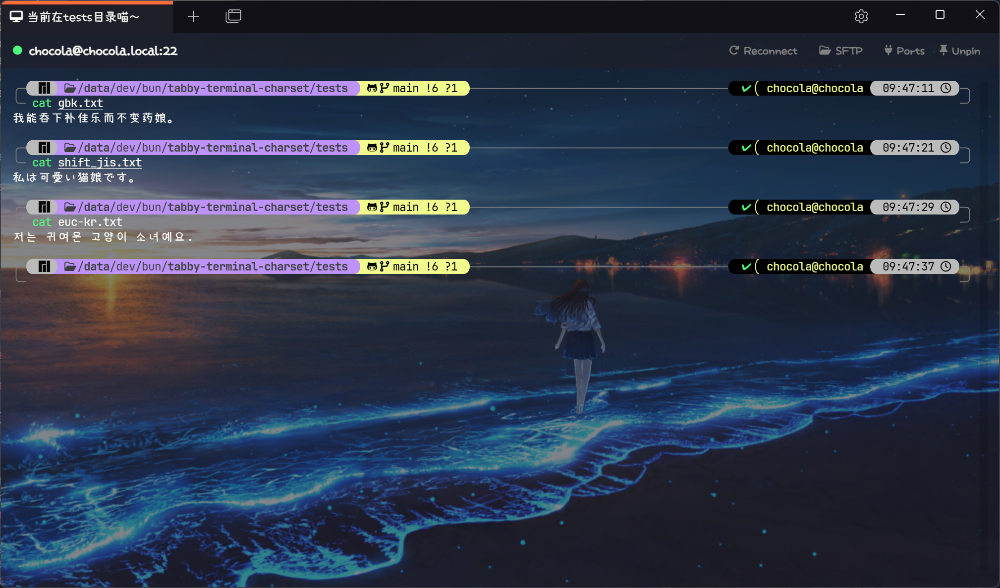

# Tabby Terminal Charset Plugin

Add a tab context menu to switch charset in Tabby terminal like gbk, shift_jis, euc-kr etc...

## Features

- [x] Support GBK/GB2312/GB18030/Big5/Shift_JIS/EUC-JP/EUC-KR charset.
- [x] Support ISO charset (ISO-8859-1 - ISO-8859-16).
- [x] Support Windows codepage (cp874, cp1250 - cp1258).
- [x] Support IBM codepage (437, 720, 737, 775, 808, 850, 852, 855-858, 860-866, 869, 922, 1046, 1124, 1125, 1129, 1133, 1161-1163).
- [x] Support KOI8 codepage (koi8-r, koi8-u, koi8-ru, koi8-t).
- [x] Support Mac codepage (maccroatian, maccyrillic, macgreek, maciceland, macroman, macromania, macthai, macturkish, macukraine, maccenteuro, macintosh).
- [x] Support Miscellaneous codepage (armscii8, rk1048, tcvn, georgianacademy, georgianps, pt154, viscii, iso646cn, iso646jp, hproman8, tis620).

## Usage

### Install

To install, use Tabby builtin plugin manager.

### Change Charset

To change terminal charset, use the context menu from tab header.

Current charset will show on context menu.

### Known Issue

When use charset other then UTF-8, but the file you view is using UTF-8, the terminal is also display as well.
That is mean the terminal will both support UTF-8 and selected charset.
Tabby not recognize charset other then UTF-8, using backspace to delete input will cause gabled character
This plugin is only for emergency use, the output may become mess if there are multiply charset mixed in one page.

## Screenshot

### Context Menu

### Test case

## Plan

### 2.0

- Setting UI for config per session charset
- Persist charset settings in config

## Changelog

- 1.1.0: Support more charset and group menu items.
- 1.0.2: Support input & output.
- 1.0.0: Initial version.
